# Financial Behavior of Tech Professionals

> Exploratory survey study of financial satisfaction and spending patterns among 75 data and analytics professionals — independent research, end-to-end from question design to publishing findings on social media.

> 📅 2026 · Solo project · Independent research

Exploratory analysis of financial satisfaction and spending patterns among data / analytics professionals, based on a 75-respondent anonymous survey.

## TL;DR

- **Independent research design:** designed a 12-question Google Form, distributed via professional network, collected 75 responses from data / analytics professionals (Intern → Head)
- **Financial comfort plateaus around 250–300k RUB/month** — beyond that band, mean self-reported comfort barely moves; within-band variance often exceeds between-band gaps
- **Food (57%), rent (44%), investments (35%)** dominate top-3 spending mentions
- **49% report their salary "dissolves"** before month-end — twice as common among juniors / middles vs seniors
- **11 visualizations + 2 wordclouds** built end-to-end in Python (pandas, seaborn, wordcloud), with hand-curated free-text categorization
- **Findings shared on social media** as a translated thread, generating organic discussion in the Russian data community

## Survey design

- **Sample:** 75 respondents, mostly product / data analysts, ages 19–31+
- **Grades:** Intern → Head (Middle and Junior dominate)
- **Salary range:** <100k to 500k+ RUB per month, net (after tax)
- **Distribution:** Google Forms, distributed via Russian-speaking data / analytics community
- **Questions:** 12 — covering salary band, grade, comfort level (1–10), emergency fund, extra income, top spending categories, plus two free-text prompts ("most 'tech' purchase this year" / "what did you start buying once salary grew")
- **Languages:** raw responses kept in Russian (`survey_data.csv`); all analysis and chart labels in English

## Key findings

- **Financial comfort plateaus around 250–300k RUB/month net.** Beyond that
  band, mean self-reported comfort barely moves — individual variance within
  a salary band is often wider than the gap between bands.
- **Food dominates spending:** 57% of respondents list food & restaurants in
  their top-3 categories, followed by rent (44%) and investments / savings (35%).
- **Half feel their salary "dissolves" (49%).** The feeling is ~2× more
  common among juniors / middles than among seniors.
- **87% have some emergency fund; 20% have 1 year+.** 13% have none at all.
- **45% have additional income sources** — freelance / consulting is common
  in this cohort.

## Visualizations

### 1. More money = more happiness?
Financial comfort self-rating (1–10) plotted against salary band. Each dot is
one respondent; the diamond line traces the group mean.

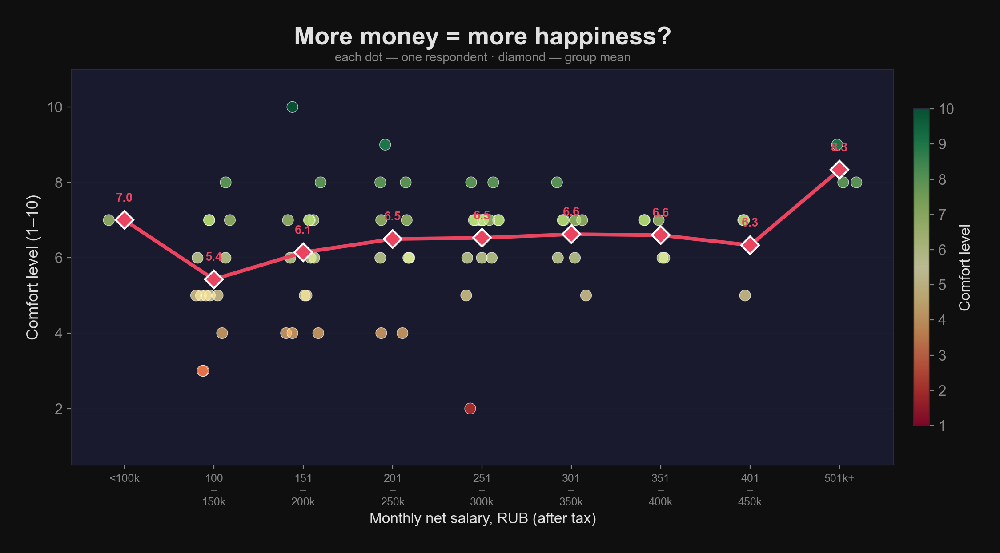

### 2. Where does the money go?
Top-3 spending categories aggregated across all respondents (multi-select,
so mentions sum to >100%).

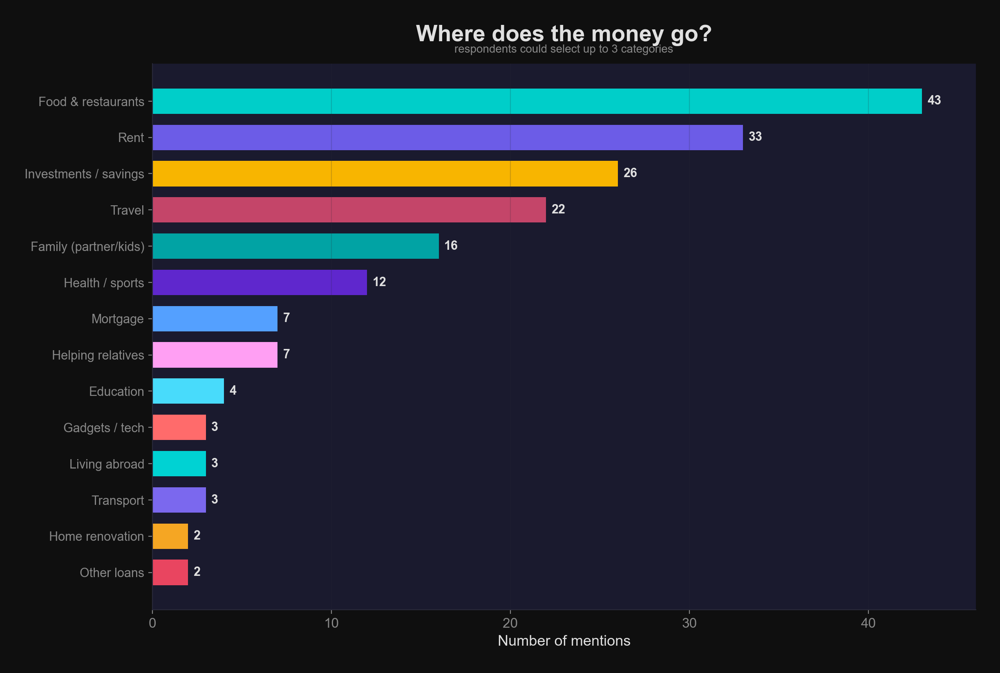

### 3. Who feels their salary "dissolves"?
Yes / No split, broken down by grade and by salary band.

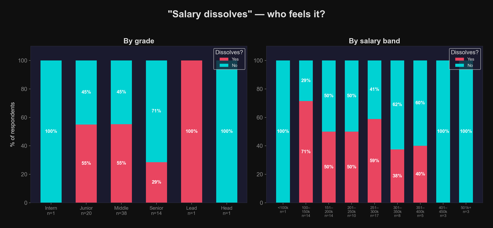

### 4. Emergency fund distribution by grade
Grouped bars showing what share of each grade has which size of cushion
(from none to 1 year+).

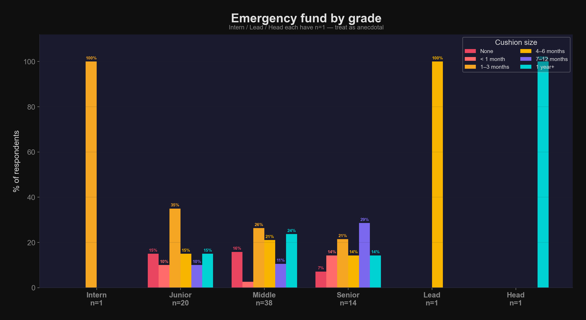

### 5. Salary distribution by grade
Boxplot + jittered scatter. Grade boundaries are blurry — some middles
out-earn some seniors.

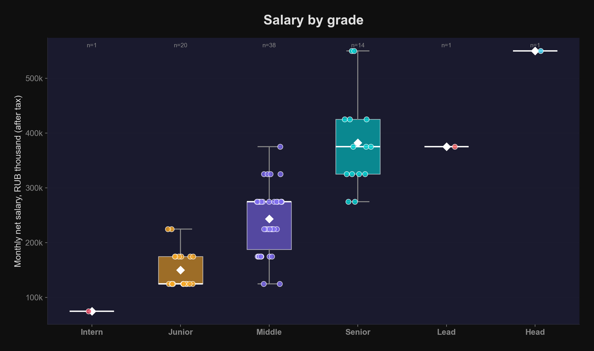

### 6. Spending ladder
Free-text answers to *"what did you start buying once salary grew?"*
were bucketed into categories and aggregated by broader salary bands.

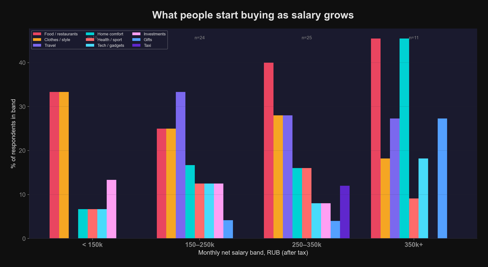

### 7–8. Wordclouds (respondent answers, Russian)
Hand-curated frequencies from two free-text prompts. Terms are kept in
the original Russian because much of the flavour lives in specific
phrasings (brand names, store names, in-jokes). Translations of the
top terms are listed below.

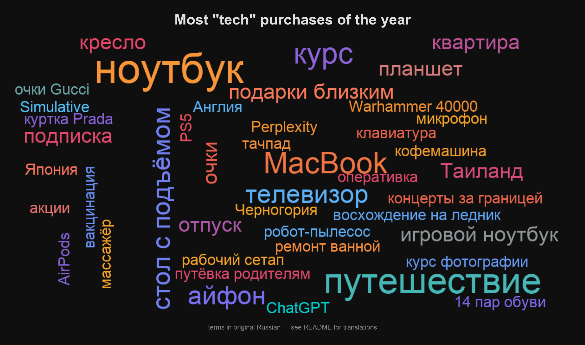
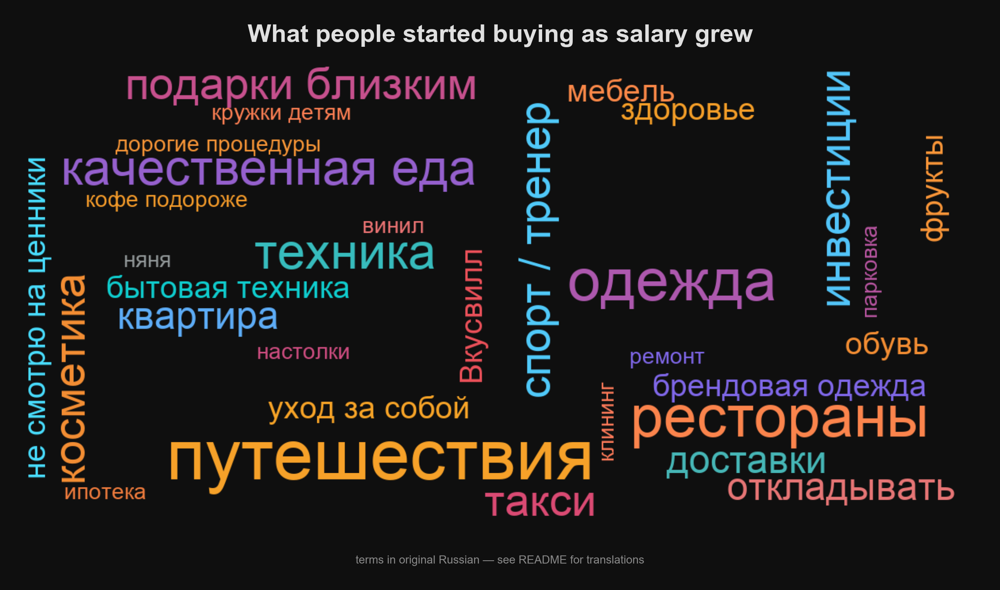

#### Top terms — "Most 'tech' purchase this year"
| Russian | English |
|---|---|
| ноутбук / MacBook / игровой ноутбук | laptop / MacBook / gaming laptop |
| путешествие, отпуск | travel, vacation |
| стол с подъёмом | sit-stand desk |
| курс | (online) course |
| кресло | ergonomic chair |
| айфон, планшет, телевизор | iPhone, tablet, TV |
| квартира, ремонт ванной | apartment, bathroom renovation |
| подарки близким, путёвка родителям | gifts for loved ones, a trip for parents |
| восхождение на ледник | a glacier climb |
| концерты за границей | concerts abroad |
| Warhammer 40000, PS5, куртка Prada, 14 пар обуви | (outliers: Warhammer 40000, PS5, Prada jacket, 14 pairs of shoes) |

#### Top terms — "What did you start buying once salary grew?"
| Russian | English |
|---|---|
| путешествия | travel |
| рестораны | restaurants |
| одежда / брендовая одежда / обувь | clothing / branded / shoes |
| качественная еда, Вкусвилл, фрукты | higher-quality groceries (Vkusvill), fruit |
| такси | taxi |
| техника, бытовая техника | tech / home appliances |
| косметика, уход за собой | cosmetics, self-care |
| спорт / тренер, здоровье | sport / personal trainer, health |
| инвестиции, откладывать | investments, saving |
| подарки близким | gifts for loved ones |
| квартира, мебель, ремонт, клининг | apartment, furniture, renovation, cleaning service |
| няня, кружки детям, дорогие процедуры | nanny, kids' activities, expensive treatments |
| "не смотрю на ценники" | *"I don't look at price tags"* |

### 9. Extra income by grade
Share with secondary income sources, overall and by grade.

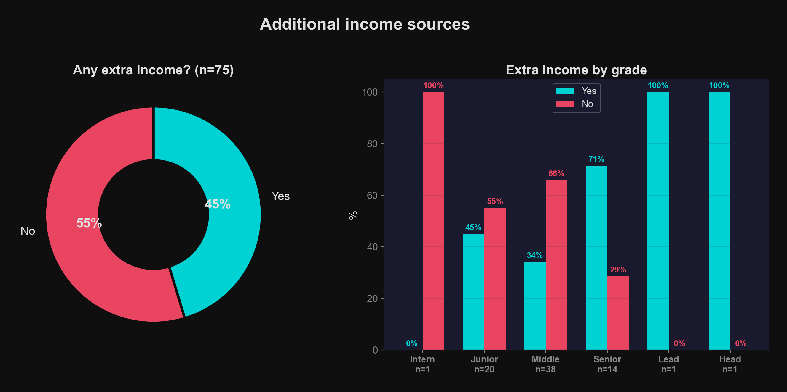

### 10. Grade × Salary heatmap
Respondent headcount at each grade / salary intersection — shows where
the mass of the sample sits (middles at 251–300k).

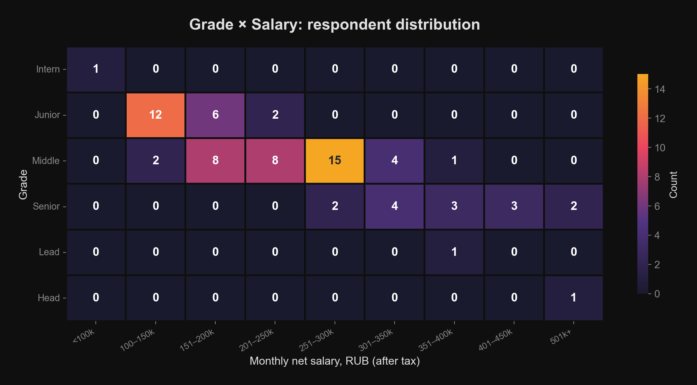

### 11. Golden quotes
Selected memorable answers with English translations.

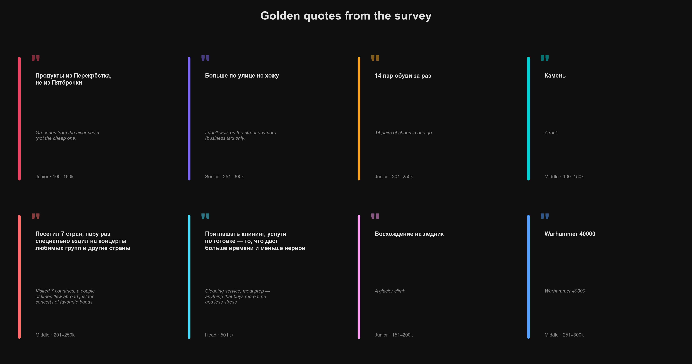

## Selected respondent quotes (translated)

> *"Groceries from the nicer chain, not the cheap one."* — Junior, 100–150k

> *"A rock."* — Middle, 100–150k, on what they started buying with a raise

> *"14 pairs of shoes in one go."* — Junior, 201–250k

> *"I don't walk on the street anymore — business taxi only."* — Senior, 251–300k

> *"Visited 7 countries; a couple of times flew abroad just for concerts of
> favourite bands."* — Middle, 201–250k

> *"Cleaning service, meal prep — anything that buys more time and less stress."*
> — Head, 501k+

> *"A glacier climb."* — Junior, 151–200k

## Methodology notes

- Salary is self-reported in bands (e.g. `201к-250к`, meaning 201,000–250,000
  RUB/month net) — not exact values. For the by-grade boxplot, midpoints of
  each band are used as a numeric proxy. All figures are net (after income
  tax), monthly — see the convention note at the top.
- Free-text answers are hand-curated into canonical terms for the wordclouds;
  see the `tech_freq` / `purchase_freq` dictionaries in the notebook.
- "Salary dissolves" is a Russian idiom for *"my paycheck evaporates before
  the month ends"* — the survey question was yes / no.
- Grade / salary cell counts are small (n≤38 for the biggest grade). Treat
  all numbers as indicative rather than statistically significant.

## Reproducing

Requires Python 3.9+ and macOS or Linux (the wordcloud font path is macOS;
on Linux change `/System/Library/Fonts/Supplemental/Arial.ttf` to any local
TTF that supports Cyrillic).

```bash
pip install -r requirements.txt
jupyter nbconvert --to notebook --execute survey_analysis.ipynb --inplace
```

Charts are written to [`charts/`](charts/).

## Files

| File | Purpose |
|---|---|
| [`survey_analysis.ipynb`](survey_analysis.ipynb) | Full analysis, 12 sections, 11 charts |
| [`survey_data.csv`](survey_data.csv) | Raw survey export (Russian column headers and values) |
| [`charts/`](charts/) | Generated visualizations |
| [`requirements.txt`](requirements.txt) | Python dependencies |

## Tech stack

| Category | Tools |
|----------|-------|
| Survey collection | Google Forms |
| Data processing | Python, pandas |
| Visualization | matplotlib, seaborn |
| Word clouds | wordcloud (with Russian Cyrillic font support) |
| Notebook | Jupyter |

## Author

**Mary Rymar** — Data Analyst, Fraud & Risk Analytics  
[LinkedIn](https://www.linkedin.com/in/rymarmary) · [GitHub](https://github.com/rymarmary)

> Survey distributed to Russian-speaking colleagues in data / analytics; raw answers remain in Russian. All translations in this README are author's own.
